# College Placement Portal — Comprehensive Project Analysis & Upgrade Roadmap

> **Document Version:** 1.0.0  
> **Repository:** `team-f-coding-savvy` (College Placement Portal)  
> **Last Analyzed:** September 2026  
> **Status:** Prototype / Pre-Alpha  

---

## Table of Contents
1. [Executive Summary](#1-executive-summary)
2. [Current Architecture & Tech Stack](#2-current-architecture--tech-stack)
3. [Existing Project Structure & File Map](#3-existing-project-structure--file-map)
4. [Role-Based Access Control (RBAC) Audit](#4-role-based-access-control-rbac-audit)
5. [Database Architecture: Current vs. Target](#5-database-architecture-current-vs-target)
6. [Feature-by-Feature Status](#6-feature-by-feature-status)
7. [Placement Lifecycle Audit](#7-placement-lifecycle-audit)
8. [Security & Architectural Vulnerabilities](#8-security--architectural-vulnerabilities)
9. [Technical Debt, Bugs & Dead Code](#9-technical-debt-bugs--dead-code)
10. [Step-by-Step Implementation Roadmap](#10-step-by-step-implementation-roadmap)

---

## 1. Executive Summary

The project is a **Next.js 16 (App Router)** prototype for a **College Placement Portal**. 

The intended vision encompasses a **4-role hierarchy**:
1. **Admin** (System configuration, user management, audit logs)
2. **TPO** (Company management, placement drive scheduling, eligibility definition, shortlisting, offers)
3. **Student Coordinator** (Drive attendance, test coordination, student communication)
4. **Student** (Profile, resume upload, eligible drive discovery, application tracking, offer acceptance)

### Current Reality
- **Roles:** Only 2 roles are partially represented (Student and pseudo-Admin). Role separation is hardcoded to a single email address (`admin@gmail.com`) in `middleware.js`. The **TPO** and **Student Coordinator** roles do not exist.
- **Workflow:** The system terminates at **Application Submission**. There are no eligibility rule evaluations, selection rounds, shortlisting workflows, or offer letter management.
- **Foundation:** The frontend styling (Tailwind CSS v4 + Radix/Shadcn primitives) and Supabase Auth integration are clean and modern. It is strongly recommended to **refactor and upgrade this existing codebase** rather than rebuilding from scratch.

---

## 2. Current Architecture & Tech Stack

### Actual Technologies Implemented
- **Frontend Framework:** Next.js 16.1.3 (App Router, React 19.2.3, React Compiler enabled)
- **Styling & UI:** Tailwind CSS v4 (`@tailwindcss/postcss: ^4`), Lucide React icons, Sonner (toasts), Radix UI primitives (`@radix-ui/react-*`)
- **Backend Architecture:** Next.js Server Actions (`"use server"`). *Zero traditional REST endpoints under `app/api/*`.*
- **Authentication:** Supabase Auth (GoTrue) using email and password, cookie persistence via `@supabase/ssr: ^0.8.0`.
- **Database:** Supabase Cloud (PostgreSQL) accessed via `@supabase/supabase-js: ^2.91.0`.
- **Storage:** Supabase Storage (`resumes` bucket) for PDF documents.
- **AI Integration:** Google GenAI SDK (`@google/genai: ^1.39.0`) targeting `gemini-2.5-flash` for resume critiquing.

### Communication Flow

```text
Browser Client
   │
   ▼
Edge Middleware (middleware.js) ─── Checks Supabase cookie session & 'admin@gmail.com'
   │
   ▼
Client Component Pages (app/*)
   │
   ▼
Server Actions (app/actions/*)
   │
   ├──────────────────────────────┬────────────────────────────┐
   ▼                              ▼                            ▼
Supabase PostgreSQL DB      Supabase Storage (resumes)    Google Gemini AI
(profiles, opportunities,                                 (resume critique)
 applications)
```

---

## 3. Existing Project Structure & File Map

```text
portal/
├── app/
│   ├── actions/                                # Server-side business logic
│   │   ├── applications.actions.js             # Apply, fetch applications, status updates
│   │   ├── opportunities.actions.js            # Job CRUD and non-applied opportunity queries
│   │   └── profile.actions.js                  # Profile management & resume uploads
│   ├── admin/                                  # Admin protected views
│   │   ├── dashboard/page.jsx                  # Aggregate metric counters
│   │   ├── opportunities/page.jsx              # Opportunity management list
│   │   ├── opportunities/new/page.jsx          # Opportunity creation form
│   │   ├── opportunities/[id]/edit/page.jsx    # Opportunity edit/close form
│   │   ├── opportunities/[id]/applicants/page.jsx # Opportunity applicant table
│   │   ├── students/page.jsx                   # Student profile directory
│   │   └── layout.jsx                          # Admin sidebar layout
│   ├── applications/page.jsx                   # Student applied jobs dashboard
│   ├── login/page.jsx                          # Supabase sign-in
│   ├── opportunities/page.jsx                  # Student job browse feed
│   ├── profile/page.jsx                        # Student profile view
│   ├── profile/edit/page.jsx                   # Student profile & resume upload form
│   ├── profile/resume-feedback/                # AI resume feedback UI & action
│   ├── signup/page.jsx                         # Student registration
│   ├── globals.css                             # Tailwind v4 token system
│   ├── layout.js                               # Root layout with Toaster
│   └── page.js                                 # Root page (redirects to /signup)
├── components/
│   ├── admin/Sidebar.jsx                       # Admin navigation bar
│   ├── profile/                                # Profile modular components
│   │   ├── ProfileCard.jsx                     # Profile info card
│   │   ├── ResumeCard.jsx                      # Resume viewer card
│   │   ├── SkillsList.jsx                      # Skills badge viewer
│   │   └── ProfileImageUploader.jsx            # [DEAD CODE] Unused image uploader
│   ├── ui/                                     # Radix UI primitives
│   ├── OpportunityCard.jsx                     # Job listing card with Apply button
│   ├── ProfileForm.jsx                         # [DEAD CODE] Obsolete form
│   ├── ResumeUploader.jsx                      # [DEAD CODE] Obsolete uploader
│   ├── Sidebar.jsx                             # [DEAD CODE] Obsolete dark sidebar
│   ├── StudentDashboard.jsx                    # [BUGGY / DEAD CODE] Recursive self-import
│   ├── StudentFooter.jsx                       # Student footer
│   ├── StudentNavbar.jsx                       # Student header with avatar
│   └── StudentProfileCard.jsx                  # [DEAD CODE] Mock profile card
├── data/
│   └── opportunities.js                        # [DEAD CODE] Static mock opportunities
├── lib/
│   ├── supabase/
│   │   ├── supabaseClient.js                   # Browser client (createBrowserClient)
│   │   └── supabaseServer.js                   # Server client with cookies
│   └── utils.js                                # cn() class merger
├── middleware.js                               # Route protection middleware
└── package.json                                # Dependency definitions
```

---

## 4. Role-Based Access Control (RBAC) Audit

### Current Status

| Role | Frontend Route Access | Server Action Access | Database Security | Status |
| :--- | :--- | :--- | :--- | :--- |
| **Admin** | `/admin/*` allowed. Student routes blocked. | All actions executable. | Reads/writes all tables. | ⚠️ Fragile (Bound to `admin@gmail.com`). |
| **TPO** | None. | None. | None. | ❌ Completely Missing. |
| **Coordinator** | None. | None. | None. | ❌ Completely Missing. |
| **Student** | `/opportunities`, `/applications`, `/profile/*`. | Authorized actions + Admin actions (due to missing checks). | Self profile & applications. | ⚠️ Severely Under-secured. |

### Flaws to Resolve
1. **Hardcoded Admin Email:** In [`middleware.js`](file:///c:/Users/aadir/Desktop/portal/middleware.js), `const ADMIN_EMAIL = "admin@gmail.com";` governs admin access.
2. **Missing Server Action RBAC:** Next.js Server Actions (`createOpportunity`, `closeOpportunity`, `deleteProfileById`, `updateApplicationStatus`) do not perform any session or role verification. Anyone can execute admin actions over HTTP POST.

---

## 5. Database Architecture: Current vs. Target

### Current Database Tables (Supabase PostgreSQL)
1. **`profiles`:** `id`, `user_id`, `name`, `email`, `college`, `branch`, `skills` (comma-separated string), `resume_url` / `resume_path`, `created_at`, `updated_at`.
2. **`opportunities`:** `id`, `company_name`, `role`, `description`, `required_skills`, `deadline`, `status`, `created_at`, `updated_at`.
3. **`applications`:** `id`, `student_id` (FK $\rightarrow$ `profiles.id`), `opportunity_id` (FK $\rightarrow$ `opportunities.id`), `status`, `applied_at`, `created_at`.
4. **Storage Bucket:** `resumes` (public bucket storing PDF resumes).

### Target Relational Database Schema (Recommended)

```sql
-- 1. Roles and Core Enums
CREATE TYPE user_role AS ENUM ('admin', 'tpo', 'coordinator', 'student');
CREATE TYPE drive_status AS ENUM ('draft', 'published', 'in_progress', 'completed', 'cancelled');
CREATE TYPE application_status AS ENUM ('applied', 'eligible', 'ineligible', 'shortlisted', 'rejected', 'selected');

-- 2. Extended Profiles Table
CREATE TABLE profiles (
    id UUID PRIMARY KEY DEFAULT gen_random_uuid(),
    user_id UUID UNIQUE NOT NULL REFERENCES auth.users(id) ON DELETE CASCADE,
    role user_role NOT NULL DEFAULT 'student',
    full_name TEXT NOT NULL,
    email TEXT UNIQUE NOT NULL,
    college_id_number TEXT UNIQUE, -- Roll Number
    department TEXT NOT NULL,
    degree TEXT NOT NULL,          -- B.Tech, M.Tech, etc.
    graduation_year INT NOT NULL,
    cgpa NUMERIC(4,2) NOT NULL DEFAULT 0.00,
    live_backlogs INT DEFAULT 0,
    dead_backlogs INT DEFAULT 0,
    resume_storage_path TEXT,
    skills TEXT[],
    is_verified BOOLEAN DEFAULT FALSE,
    created_at TIMESTAMPTZ DEFAULT NOW(),
    updated_at TIMESTAMPTZ DEFAULT NOW()
);

-- 3. Dedicated Companies Table
CREATE TABLE companies (
    id UUID PRIMARY KEY DEFAULT gen_random_uuid(),
    name TEXT NOT NULL,
    website TEXT,
    industry TEXT,
    hr_contact_name TEXT,
    hr_contact_email TEXT,
    created_at TIMESTAMPTZ DEFAULT NOW()
);

-- 4. Placement Drives Table (Replacing Generic Opportunities)
CREATE TABLE placement_drives (
    id UUID PRIMARY KEY DEFAULT gen_random_uuid(),
    company_id UUID NOT NULL REFERENCES companies(id) ON DELETE CASCADE,
    title TEXT NOT NULL,
    job_description TEXT,
    job_location TEXT,
    package_lpa NUMERIC(6,2),
    min_cgpa NUMERIC(4,2) DEFAULT 0.00,
    allowed_departments TEXT[] NOT NULL,
    max_live_backlogs INT DEFAULT 0,
    registration_deadline TIMESTAMPTZ NOT NULL,
    status drive_status DEFAULT 'draft',
    created_by UUID REFERENCES profiles(id),
    created_at TIMESTAMPTZ DEFAULT NOW()
);

-- 5. Selection Rounds Table
CREATE TABLE drive_rounds (
    id UUID PRIMARY KEY DEFAULT gen_random_uuid(),
    drive_id UUID NOT NULL REFERENCES placement_drives(id) ON DELETE CASCADE,
    round_number INT NOT NULL,
    round_name TEXT NOT NULL, -- e.g. Aptitude Test, Tech Interview
    scheduled_at TIMESTAMPTZ,
    venue_or_link TEXT
);

-- 6. Applications Table
CREATE TABLE applications (
    id UUID PRIMARY KEY DEFAULT gen_random_uuid(),
    drive_id UUID NOT NULL REFERENCES placement_drives(id) ON DELETE CASCADE,
    student_id UUID NOT NULL REFERENCES profiles(id) ON DELETE CASCADE,
    status application_status DEFAULT 'applied',
    current_round_id UUID REFERENCES drive_rounds(id),
    applied_at TIMESTAMPTZ DEFAULT NOW(),
    UNIQUE(drive_id, student_id)
);

-- 7. Placement Offers Table
CREATE TABLE placement_offers (
    id UUID PRIMARY KEY DEFAULT gen_random_uuid(),
    application_id UUID UNIQUE NOT NULL REFERENCES applications(id),
    student_id UUID NOT NULL REFERENCES profiles(id),
    drive_id UUID NOT NULL REFERENCES placement_drives(id),
    offered_ctc NUMERIC(6,2) NOT NULL,
    offer_letter_path TEXT,
    is_accepted BOOLEAN,
    decided_at TIMESTAMPTZ,
    created_at TIMESTAMPTZ DEFAULT NOW()
);
```

---

## 6. Feature-by-Feature Status

| Area | Feature | Status | Details |
| :--- | :--- | :---: | :--- |
| **Auth** | Login | ✅ Functional | Supabase email/password with redirect handling. |
| | Signup | ✅ Functional | Supabase registration with name metadata. |
| | Logout | ✅ Functional | Client-side sign out and redirect to `/login`. |
| | Password Reset | ❌ Missing | "Forgot password?" is unhandled. |
| **Student** | Profile View | ✅ Functional | Name, email, college, branch, skills badges, resume. |
| | Profile Edit | ✅ Functional | Updates profile details and uploads resume PDF. |
| | Browse Drives | ⚠️ Partial | Lists unapplied jobs, but cannot check academic eligibility. |
| | Apply to Job | ✅ Functional | Records application entry in Supabase. |
| | Track Applications | ✅ Functional | Shows cards with statuses (applied, shortlisted, rejected). |
| | AI Resume Review | 🐛 Broken | Logic exists, but crashes if `GEMINI_API_KEY` is missing. |
| | Offer Acceptance | ❌ Missing | No offer viewing or decision workflows. |
| **Admin** | Dashboard | ⚠️ Partial | Metric cards; "Students Placed" is hardcoded to `0`. |
| | Manage Drives | ⚠️ Partial | Create, edit, close opportunities work, but lack UX feedback. |
| | View Applicants | ⚠️ Partial | Applicant table exists; resume viewing works. |
| | Shortlist Candidates| ⚠️ Partial | Server action exists, but UI buttons are absent. |
| | Student Directory | ⚠️ Partial | Read-only cards without search, filter, or verification. |
| | Export CSV | ❌ Missing | "Download CSV" button is a static placeholder. |
| **TPO** | Full Module | ❌ Missing | No company profiles, drive scheduling, or TPO views. |
| **Coordinator** | Full Module | ❌ Missing | No coordinator portal or drive attendance tools. |

---

## 7. Placement Lifecycle Audit

```mermaid
flowchart LR
    A["1. Company"] -.->|Missing| B["2. Placement Drive"]
    B -->|Partial| C["3. Eligibility"]
    C -.->|Missing| D["4. Eligible Students"]
    D -->|Partial| E["5. Application"]
    E -->|Functional| F["6. Shortlisting"]
    F -.->|No UI| G["7. Rounds/Interviews"]
    G -.->|Missing| H["8. Offers/Placement"]

    style A fill:#fee2e2,stroke:#ef4444
    style B fill:#fef3c7,stroke:#f59e0b
    style C fill:#fee2e2,stroke:#ef4444
    style D fill:#fef3c7,stroke:#f59e0b
    style E fill:#dcfce7,stroke:#22c55e
    style F fill:#fef3c7,stroke:#f59e0b
    style G fill:#fee2e2,stroke:#ef4444
    style H fill:#fee2e2,stroke:#ef4444
```



*The system currently halts after **Step 5 (Application Submission)**.*

---

## 8. Security & Architectural Vulnerabilities

1. **Insecure Server Actions (Critical):**
   - In `profile.actions.js`, `deleteProfileById` permits any unauthenticated user to delete any student profile and resume.
   - In `opportunities.actions.js`, any caller can create, modify, or close opportunities.
2. **Server Actions Using Browser Client (Medium):**
   - Server Actions import `createClient` from `@/lib/supabase/supabaseClient.js` instead of `@/lib/supabase/supabaseServer.js`. They do not forward request cookies, losing the caller's authentication state.
3. **Public Storage Bucket (Medium):**
   - The `resumes` bucket is public. Anyone can download student resumes if they know or iterate the file path.
4. **Data Exfiltration Risk (High):**
   - `getAllProfiles()` exposes all student contact information and resumes without requiring authentication.

---

## 9. Technical Debt, Bugs & Dead Code

- **Circular Import:** `components/StudentDashboard.jsx` imports itself recursively.
- **Unused Dead Files:**
  - `components/ProfileForm.jsx`
  - `components/ResumeUploader.jsx`
  - `components/Sidebar.jsx`
  - `components/StudentProfileCard.jsx`
  - `components/profile/ProfileImageUploader.jsx`
  - `data/opportunities.js`
- **Component Anti-Pattern:** In `admin/opportunities/[id]/applicants/page.jsx`, `ResumeViewButton` is declared inside `applicants.map(...)`.
- **Navigation Typos:** Missing leading slashes in `LoginPage` (`router.push("admin/dashboard")`) and relative path link in `ProfilePage` (`href="./profile/resume-feedback"`).
- **Date Parsing Bug:** In `admin/opportunities/[id]/edit/page.jsx`, calling `new Date("").toISOString()` when deadline is blank throws a fatal `RangeError`.

---

## 10. Step-by-Step Implementation Roadmap

```text
Phase 1: Housekeeping & Security Core
  ├── Step 1: Remove dead files & fix navigation bugs
  ├── Step 2: Fix Server Action client instantiation (supabaseServer)
  └── Step 3: Implement database-backed 4-role RBAC

Phase 2: Database & Academic Profile Expansion
  ├── Step 4: Run Supabase SQL migrations (companies, drives, rounds, offers)
  └── Step 5: Expand student profile (CGPA, backlogs, branch, roll number)

Phase 3: Core Placement Lifecycle
  ├── Step 6: Create dedicated Companies & Placement Drives modules
  ├── Step 7: Build automated Eligibility Matching Engine
  ├── Step 8: Build TPO Applicant Shortlisting & Round Management UI
  └── Step 9: Build Selection, Offers & Placement Records Module

Phase 4: Polish & Reporting
  └── Step 10: Implement CSV export, email alerts, and TPO analytics
```

This document serves as the architectural baseline for all future development phases.
